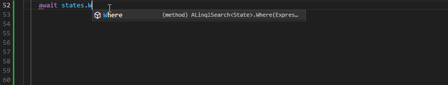
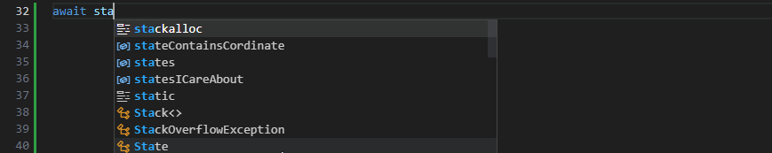
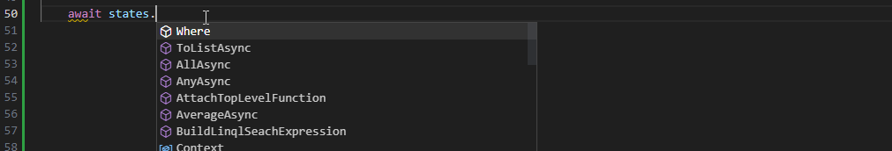

# Linql

Linql is a next generation graph api library.  It's primary goal is to provide language-native graph api integration to achieve consistency and scale across the web. 

> Linql is currently in alpha1.  Support for C# and Typescript may be production ready and significantly improve your web development experience. 

[Read the white paper](./WhitePaper.md)  

## Support

If Linql resonates with you, `please consider supporting the project, as the entire stack is maintained by a single developer`.  

### Ethereum

```
0x50373B51Cb601827CcC1Dc5472251031d2fdBF89
```

### Github Sponsor
You can also [sponsor me on my profile](https://github.com/TheKrisSodroski) or by using the [sponsorship button](https://github.com/sponsors/TheKrisSodroski) in this repo if you wish to `receive individualized support`, `prioritize features`, or `advertise your support for Linql`. 

### Hire Me

[LinkedIn](https://www.linkedin.com/in/kris-sodroski-60001480/)

[sodroski@bu.edu](mailto:sodroski@bu.edu)

## Unparalleled Developer Experience 

Because Linql is language-native, it is small, light-weight, and robust.  

Using Linql allows you to interact with your api with compile-time safety and full typeahead support, significantly reducing developer time in comparison to other systems.

#### **`Typescript`**



#### **`C#`**



#### **`Python`**


## Client Examples

#### **`C#`**
```cs 
List<string> codesICareAbout = new List<string>() { "al", "ma" };

List<State> statesICareAbout = await states
.Where(r => codesICareAbout.Select(t => t.ToUpper()).Contains(r.State_Code))
.ToListAsync();
```

#### **`Typescript`**
```typescript
this.CodesICareAbout = ["al", "ma"];
...
const statesICareAbout: Array<State> = search
.Where(r => this.CodesICareAbout.Select(t => t.ToUpper()).Contains(r.State_Code!))
.ToListAsync();

```

#### **`Python`**
```python
statesICareAbout = ["al", "ma"]
search.Where(lambda r: any(lambda x: r.State_Code in x, map(lambda t: t.upper(), statesICareAbout))).ToListAsync()
```

#### **`Java`**
```java
List<String> codesICareAbout = Arrays.asList("al", "ma");

List<State> statesICareAbout = states
.stream()
.filter(r => codesICareAbout.stream().map(t => t.toUpperCase()).collect(Collectors.toList()).contains(r))
.collect(Collectors.toList());
```

## Language Support

| Language                             | Environment | Client                                                       | Server                                           | Notes                                                                                                                                         |
| ------------------------------------ | ----------- | ------------------------------------------------------------ | ------------------------------------------------ | --------------------------------------------------------------------------------------------------------------------------------------------- |
| C#                                   |             | [Full Alpha](./C%23/Linql.Client/)                           | [Full Alpha](./C%23/Linql.Server/)               |
| [Javascript](./Typescript/README.md) |             |                                                              |                                                  | Uses Linq emulator                                                                                                                            |
| -                                    | Node        | [Full Alpha](./Typescript/projects/linql.client-node-fetch/) | Not Started                                      | [linql.client-fetch](./Typescript/projects/linql.client-fetch/) and [linql.client-node-fetch](./Typescript/projects/linql.client-node-fetch/) |
| -                                    | Angular     | [Full Alpha](./Typescript/projects/linql.client-angular/)    | n/a                                              | Has native framework wrapper                                                                                                                  |
| -                                    | React       | [Full Alpha](./Typescript/projects/linql.client-fetch/)      | n/a                                              | Needs native framework wr apper                                                                                                               |
| -                                    | Vanilla     | [Full Alpha](./Typescript/projects/linql.client-fetch/)      | n/a                                              |
| Python                               |             | [Partial Alpha](./Python/)                                   | [In Progress](./Python/linql-server-sqlalchemy/) |                                                                                                                                               |
| Java                                 |             | Not Started                                                  | Not Started                                      |

## Model Generation 

Linql is very powerful if there is automatic model generation for your consumers to use.  This can be accomplished with the [Linql.ModelGenerator](https://github.com/TheKrisSodroski/Linql.ModelGenerator).

## Acknowledgements 

Big thanks to: 
- [Jeff Bender](https://github.com/jeffbender) for his unwavering support and mentorship
- [Manjot Chahal](https://www.linkedin.com/in/manjot-chahal-96740198/) for scoping out acorn
- [Sushmita Chaudhari](https://www.linkedin.com/in/sushmitachaudhari/) for scoping out System.Text.Json in it's prerelease 
